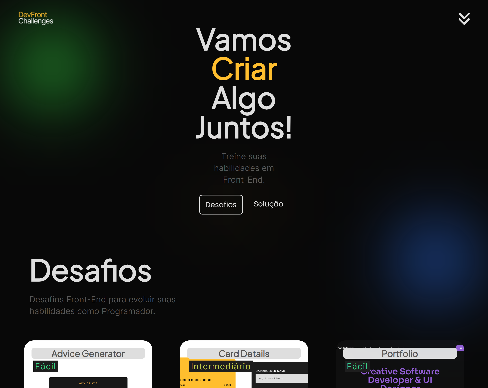

# devfrontchallenges - Front End Challenges
EN: An application that helps you to build new projects and with many ideas.

PT-BR: Uma aplicação que ajuda e oferece projetos e desafios para Desenvolvedores iniciantes.

## Overview 👋

### Screenshot 📲

You can see this one, it's my solution and i liked to make it.👋

### Links ☕

- Repository link: [https://github.com/devlucaspro/devfrontchallenges](https://github.com/devlucaspro/devfrontchallenges)
- Live Site URL: [https://devfrontchallenges.netlify.app/](https://devfrontchallenges.netlify.app/)

## My process 🔥

### Built with

- Semantic HTML5 markup
- CSS
- Flexbox
- Responsive web application
- Javascript
- Javascript DOM

## Author 👋

I'm Front End Web developer and UI Designer, you can see more about me on these links below.

- Portfolio - [Lucas Ribeiro](https://lucasdeveloper.netlify.app/)
- Frontend Mentor - [@devlucaspro](https://www.frontendmentor.io/profile/devlucaspro)
- My links - [Connect with me](https://devlucaslinks.netlify.app/)
